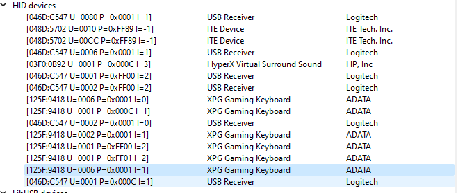
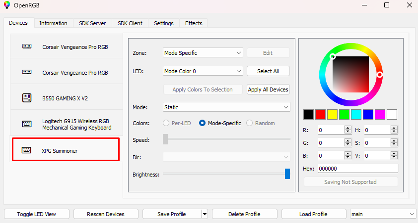

# XPG Summoner Keyboard Controller for OpenRGB

OpenRGB is a cross-platform RGB Controller for operating systems. You don't have to install bloatware apps like Razer Synapse, Asus Aura, Corsair iCue. You can control multiple devices with one click and also synchronize them all together.

## XPG Summoner PID,VID and Endpoint Page

I did reverse engineering to capture some packets with WireShark. There is 2 packets for RGB control with HID protocol (commonly used by USB devices) and I will try to read that packets to send my own packets.

